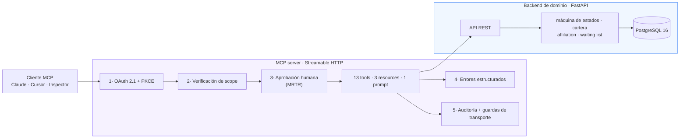

# dental-clinic-mcp-server

> Un MCP server de grado producción para una clínica odontológica: citas,
> validación de afiliación y cartera, con los controles de seguridad que el 92%
> del ecosistema MCP no tiene.
>
> 🇬🇧 [Read it in English](./README.md)

<p align="left">
  
  
  
  
  
  
</p>

```bash
cp .env.example .env && make up && make smoke
```

---

## Por qué existe

Hay más de 22.000 MCP servers publicados. Las auditorías muestran que el **40%
no tiene autenticación**, el **79% maneja credenciales en texto plano** y solo
el **8,5% implementa OAuth**. En enero de 2026 incluso el server de referencia
de Anthropic acumuló tres CVEs: path traversal, borrado de archivos y RCE.

El dominio no es el diferenciador; la ingeniería sí. Este repositorio demuestra
cómo se ve ese 8,5%.

El riesgo que ataca es concreto. En julio de 2025 un agente de IA borró una base
de datos de producción en SaaStr durante un code-freeze: tenía permisos de
escritura que nunca necesitó y nadie podía revocárselos granularmente. Su token
era válido, así que los scopes por sí solos no lo habrían detenido. Lo que
faltaba era un humano entre la intención y el efecto. Ambas cosas están
implementadas aquí.

## Dominio: por qué una clínica odontológica en Colombia

Nada en este server es inventado. La máquina de estados de la cita, la
validación de afiliación contra los regímenes colombianos, las reglas de copago
y la lista de espera son el proceso real que corre una clínica o IPS todos los
días. Alrededor del **25% de las citas agendadas no se usan cada mes**, y por eso
existen la confirmación a 48 horas y la liberación de cupos: las herramientas
que los implementan atacan un dolor cuantificado, no un guion de demo.

Hay además una frontera regulatoria que vuelve necesaria la seguridad:
**agendar una cita no es acto médico, pero registrar el motivo de consulta sí
toca dato clínico.** Ahí aplican la Resolución 2654/2019, el consentimiento
informado y el registro RNBD ante la SIC. En esa frontera viven exactamente el
scope `clinical` y la aprobación humana obligatoria.

> **Todos los datos son sintéticos**, generados con Faker y semilla fija. En
> ningún punto del proyecto hay información real de pacientes, y hay una prueba
> que lo verifica.

## Arquitectura



| Capa | Stack | Responsabilidad |
|---|---|---|
| Backend de dominio | FastAPI + PostgreSQL 16 + SQLAlchemy 2.x | Fuente de verdad. No sabe nada de MCP. |
| MCP server | MCP Python SDK v2, Streamable HTTP (sin estado) | Traduce el dominio a tools/resources/prompts. **Aquí viven todos los controles de seguridad.** |
| Authorization Server | OAuth 2.1 propio (o Keycloak) | Emite tokens. Intercambiable sin tocar el resource server. |

Separar el backend del MCP server es en sí el punto: en producción el MCP server
casi nunca *es* el sistema, envuelve uno que ya existe. El LLM nunca toca la base
de datos directamente.

Razonamiento completo y diagramas: [`docs/architecture.es.md`](./docs/architecture.es.md).

## El catálogo de herramientas

Trece, no treinta. La precisión del modelo cae pasadas 25-30 tools, así que un
catálogo pequeño y descrito con precisión es el diseño, no una limitación.

| Scope | Herramientas |
|---|---|
| `read` | `search_patients` · `check_availability` · `get_appointment` · `list_patient_appointments` · `check_cartera` · `validate_affiliation` |
| `write` | `book_appointment` · `confirm_appointment` · `cancel_appointment` · `reschedule_appointment` · `record_attendance` · `offer_slot_to_waiting_list` |
| `clinical` | `record_visit_reason` |

Resources: `clinic://info`, `policies://cartera`, `agenda://today`.
Prompt: `recepcionista_odontologia`.

**Toda herramienta de escritura y la clínica se detienen a preguntarle a una
persona**, con Multi Round-Trip Requests. Llamar `cancel_appointment` no cambia nada:
vuelve preguntando.

```jsonc
// ronda 1  →  tools/call cancel_appointment {appointment_id: 412, reason: "…"}
{
  "resultType": "input_required",
  "inputRequests": {
    "…": { "method": "elicitation/create", "params": {
      "message": "Cancelar la cita 412 de Ana Gómez del 2026-09-03 09:00. Motivo: …\n\nEsto va a pasar:\n  · La cita quedará cancelada.\n  · El cupo quedará libre en la agenda.\n  · El motivo quedará registrado en el historial de la cita.\n  · Si hay lista de espera para esa especialidad, se informará al siguiente.\n\n¿Confirmas la operación?",
      "requestedSchema": { "properties": { "confirmed": { "type": "boolean" } } }
    }}
  },
  "requestState": "v1.ZZs-yBzkr3f…"          // sellado, AES-256-GCM
}

// ronda 2  →  la misma llamada + inputResponses + requestState  →  "resultType": "complete"
```

Una tool, dos llamadas, sin sesión. La confirmación la resuelve el cliente, así
que nunca aparece en el esquema de entrada: **el modelo no tiene dónde aprobar en
nombre del usuario.** El resolver vuelve a correr en la segunda ronda, así que el
scope y las reglas del dominio se reaplican en el momento del efecto.

## Dos idiomas, una regla

La clínica es colombiana y el código lo leen ingenieros que no lo son. El
repositorio resuelve eso con una sola línea:

> **Inglés para todo lo que lee un ingeniero o el modelo. Español solo para los
> términos de salud colombianos que el inglés no carga.**

Así que identificadores, nombres de tools, códigos de error, claves del cable,
tablas y columnas, mensajes de commit y nombres de pruebas van en inglés.
`cartera`, `en_mora`, `regimen`, `copago`, `cuota_moderadora`, `eps`, `nit` y los
tipos de documento se quedan en español, porque `accounts receivable` sí traduce
`cartera` pero `overdue` no traduce `en_mora`: estar en mora es una condición
jurídica definida con consecuencias, y la palabra inglesa solo describe un
retraso. La prueba es "¿el inglés lo carga fielmente?", no "¿el sector usa la
palabra en español?". `afiliacion` no pasó esa prueba y hoy es `affiliation`;
`cuota_moderadora` sí la pasa y se queda.

Hay exactamente una capa en español, y es la que lee una persona: la pregunta de
confirmación, el prompt `recepcionista_odontologia` y las etiquetas de
`backend/domain/labels.py`. **Ningún valor interno se interpola ahí.** Una
recepcionista en Bogotá nunca ve `scheduled` en mitad de una frase, porque el
estado pasa antes por `state_label()`, o la frase se redacta para no nombrarlo:

```python
# backend/domain/labels.py es el único lugar donde un valor de máquina se vuelve palabras
state_label(AppointmentState.NO_SHOW)  # "no asistió"
specialty_label("general_dentistry")  # "odontología general"
```

Una prueba de contrato llama a las cuatro tools de escritura y falla si algún
valor del enum aparece en la pregunta que aprueba una persona. Ya atrapó dos
fugas reales.

Cada documento de `docs/` y este README existen en los dos idiomas, sincronizados.

## Seguridad

Cinco capas, cada una respondiendo a una falla documentada del ecosistema.
Detalle completo y modelo de amenazas: [`docs/security.es.md`](./docs/security.es.md).

| # | Capa | Qué impide |
|---|---|---|
| 1 | **OAuth 2.1 + PKCE**, cero API keys | Acceso anónimo; un código de autorización robado |
| 2 | **Scopes por herramienta** `read`/`write`/`clinical`, sin anidar | El confused deputy; la forma SaaStr de tokens sobredimensionados |
| 3 | **Human-in-the-loop** sobre MRTR, con `requestState` sellado | Que un agente mute datos por su cuenta |
| 4 | **Errores estructurados** con siguiente paso accionable | Bucles de reintento a ciegas; stack traces filtrados |
| 5 | **Auditoría + guardas de transporte** | Cambios sin autor; DNS rebinding; agentes desbocados |

Tres endurecimientos adicionales a la especificación, porque los agentes
concurrentes los encuentran en la primera hora:

- **La doble reserva es imposible a nivel de base de datos**, con índice único
  parcial sobre el cupo más bloqueo optimista. Una validación en aplicación
  siempre pierde esa carrera.
- **Claves de idempotencia al agendar**, así un agente que reintenta recibe la
  misma cita y no un duplicado.
- **Guardar en UTC, presentar en America/Bogota**. Los datetime naive se
  rechazan en vez de adivinarse.
- **Transporte sin estado.** Una aplicación stateful no exige un transporte
  stateful: la identidad va en el token y la operación pausada va sellada en el
  `requestState` del cliente, así que cualquier réplica atiende cualquier
  petición y no hay sesión que perder.

Los scopes deliberadamente **no anidan**. Un token `write` no puede leer el
motivo de consulta y un token `clinical` no puede cancelar una cita, porque
«administrativo» y «clínico» son *tipos* distintos de autoridad, no cantidades
distintas de la misma.

## Arranque rápido

```bash
cp .env.example .env      # solo placeholders locales; aquí no hay secretos reales
make up                   # postgres + backend + authorization server + mcp
make smoke                # recorre todo el camino del cliente e imprime cada paso
```

`make up` tarda unos diez segundos desde frío y deja:

| | |
|---|---|
| MCP server | `http://localhost:8080/mcp` |
| Docs de la API de dominio | `http://localhost:8000/docs` |
| Authorization Server | `http://localhost:9000/.well-known/oauth-authorization-server` |

### Conectar un cliente MCP real

El servidor habla **Streamable HTTP**, así que cualquier cliente que soporte un
servidor MCP remoto sobre HTTP se conecta a `http://localhost:8080/mcp` con un
bearer token:

```bash
make token        # recorre el flujo real de OAuth 2.1 + PKCE e imprime el token
```

```jsonc
// Claude Code:  claude mcp add --transport http dental-clinic http://localhost:8080/mcp \
//                 --header "Authorization: Bearer $(make -s token)"
// Cualquier cliente que reciba un JSON de configuración:
{
  "mcpServers": {
    "dental-clinic": {
      "type": "http",
      "url": "http://localhost:8080/mcp",
      "headers": { "Authorization": "Bearer <token de make token>" }
    }
  }
}
```

Dos cosas que conviene saber antes de conectar.

**La ausencia de estado se nota.** No hay handshake `initialize` que completar ni
session id que arrastrar: cada petición se sostiene sola, llevando su propia
versión de protocolo y las capacidades del cliente en `params._meta`. Eso es lo
que permite que cualquier réplica atienda cualquier petición.

**Las tools de escritura necesitan un cliente capaz de preguntar.** Un cliente
que declara `elicitation` en sus capacidades recibe el flujo de confirmación. Uno
que no, recibe `CLIENT_CANNOT_CONFIRM`, que lo rechaza temprano y con claridad en
vez de fallar en el fondo del transporte. Hoy el MCP Inspector está en el segundo
grupo, y por eso existe `make consola`.

### Conectar el MCP Inspector

```bash
make consola              # cliente interactivo: tú respondes las confirmaciones
make inspector            # el Inspector, para lecturas y el catálogo
```

`make consola` es el que quieres. El SDK de JavaScript del Inspector todavía no
habla la spec 2026-07-28, así que no puede responder un `input_required`: las
lecturas funcionan ahí, las escrituras devuelven `CLIENT_CANNOT_CONFIRM`
explicando por qué.

`make token` imprime un access token obtenido con el flujo PKCE real, para curl
o para pegarlo en cualquier cliente. Prueba a emitir un token solo-`read` y
llamar `cancel_appointment`: el rechazo explica exactamente qué hacer después.

### Cambiar el Authorization Server por Keycloak

```bash
make keycloak             # Keycloak en :9100 + un segundo MCP server en :8081
make keycloak-verify      # demuestra que el cambio funciona y que los tokens no se cruzan
```

`--profile keycloak` levanta un **segundo MCP server** (misma imagen, mismo
código) que confía en un realm real de Keycloak en vez del Authorization Server
propio, y lo corre lado a lado con el original. Solo cambian `OAUTH_ISSUER` y
`OAUTH_JWKS_URL`.

`make keycloak-verify` obtiene un token de Keycloak, lo usa contra ese servidor,
y después demuestra que los dos **no** son intercambiables: cada servidor
devuelve `401` ante el token del otro. Ese rechazo es la validación de audiencia
funcionando, y es la razón de que el realm lleve un mapper de audiencia
explícito: Keycloak omite `aud` si no se lo pides, y un resource server que
acepta un token sin audiencia acepta cualquier token que ese IdP haya emitido, a
quien sea.

## Desarrollo

```bash
make install     # uv sync
make lint        # ruff + mypy --strict
make test-unit   # pruebas rápidas, sin docker
make check       # todo lo que corre CI
```

## Pruebas

Cada capa se prueba contra lo real: PostgreSQL real (nunca SQLite, donde no
existen los índices únicos parciales, los enums nativos ni los timestamps con
zona), el MCP server real, el Authorization Server real.

| Suite | Qué demuestra |
|---|---|
| `tests/unit` | Máquina de estados (7×7 exhaustiva + property-based), afiliación, cartera, orden de la lista de espera, manejo de tiempo, contrato de errores |
| `tests/integration` | Constraints del esquema, reversibilidad de migraciones, determinismo del seed, **dos conexiones vivas compitiendo por un cupo** |
| `tests/contract` | La superficie MCP: catálogo, esquemas, descripciones, resources, prompt, y cada tool ejecutada de punta a punta |
| `tests/security` | **La matriz completa 13 × 3 de scopes** sobre el cable, el estado sellado bajo ataque (alteración, reuso cruzado, principal equivocado, expiración, rotación de claves), PKCE obligatorio, audiencia del JWT y `alg=none`, guardas de Host/Origin, ausencia de estado, rate limiting |
| `scripts/smoke.py` | El camino completo del cliente sobre HTTP real, ejecutado en CI |

831 pruebas: 361 unitarias, 231 de integración, 89 de contrato, 150 de seguridad.
**¿Quieres comprobarlo tú mismo?** [`docs/pruebas-manuales.md`](./docs/pruebas-manuales.md)
es un recorrido de 25 minutos con trece pruebas, cada una diciendo qué correr y
qué deberías ver. [`docs/inspector.es.md`](./docs/inspector.es.md) cubre lo mismo
desde el MCP Inspector.

CI corta con un piso de cobertura del 95% (hoy 99%), `mypy --strict`, `ruff`,
`bandit`, `pip-audit`, y un grep que rompe el build si alguna vez llega al código
un literal con forma de secreto o una llave privada.

### Verificarlo todo tú mismo

Seis comandos, en este orden, desde un checkout limpio. Cada uno falla ruidoso.

```bash
make reset            # volumen vacío, cadena completa de migraciones, seed determinista
make lint             # ruff + ruff format --check + mypy --strict
make audit            # bandit + pip-audit
make test-fast        # 831 pruebas contra el stack corriendo, piso de cobertura del 95%
make smoke            # el camino del cliente en nueve pasos sobre HTTP real
make keycloak && make keycloak-verify    # la capa de auth es intercambiable
```

`make reset` es el que la gente se salta y el que más importa: borra el volumen
de la base y reconstruye desde cero, así que la cadena de migraciones se ejercita
de punta a punta en vez de darse por supuesta. Cada migración es reversible y
`uv run alembic check` no reporta deriva entre los modelos y el esquema vivo.

Dos afirmaciones que conviene comprobar a mano en vez de creer:

```bash
# 1 · ninguna fila se mueve cuando el esquema se renombra
docker compose exec postgres psql -U clinic -d clinic -c "select count(*) from appointment"
uv run alembic downgrade -1 && uv run alembic upgrade head
docker compose exec postgres psql -U clinic -d clinic -c "select count(*) from appointment"

# 2 · la doble reserva la rechaza PostgreSQL, no la aplicación
docker compose exec postgres psql -U clinic -d clinic \
  -c "select indexdef from pg_indexes where indexname = 'uq_appointment_slot_active'"
```

## Estructura del repositorio

```
backend/            fuente de verdad del dominio, no sabe nada de MCP
  domain/           lógica pura: states, cartera, affiliation, waiting_list, time, errors
  models.py         esquema SQLAlchemy 2.x · api.py  API REST interna
  seed.py           datos sintéticos deterministas (Faker, semilla fija)
mcp_server/
  tools/            read.py · write.py · clinical.py
  auth.py           verificación OAuth y scopes         (capas 1-2)
  confirmation.py   la pregunta que responde una persona (capa 3)
  errors.py         fallos estructurados y accionables   (capa 4)
  audit.py          log de auditoría                     (capa 5)
  rate_limit.py     limitador de ventana deslizante      (capa 5)
  oauth/            el Authorization Server propio
tests/              unit · integration · contract · security
docs/               architecture.md · security.md (bilingües)
```

## Licencia

MIT. Proyecto de portafolio, Horizonte Labs.
