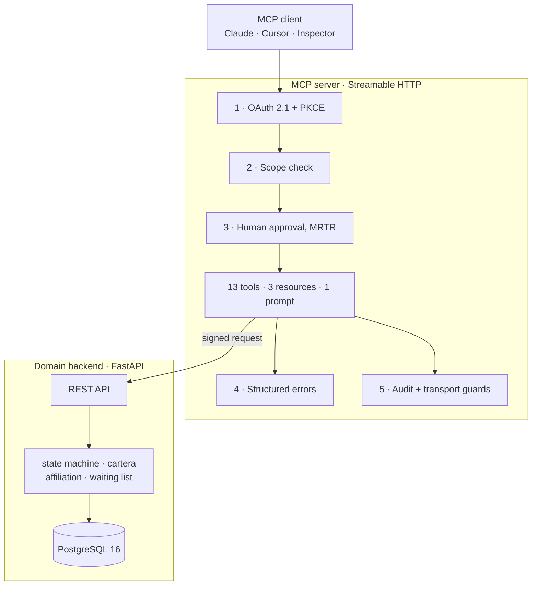

# dental-clinic-mcp-server

> A production-grade MCP server for a dental clinic: appointments, affiliation
> checks and accounts receivable, with the security controls that 92% of the
> MCP ecosystem does not have.
>
> 🇪🇸 [Léelo en español](./README.es.md)

<p align="left">
  
  
  
  
  
  
</p>

```bash
cp .env.example .env && make up && make smoke
```

---

## Why this exists

There are 22,000+ MCP servers listed publicly. Audited samples show **40% ship
with no authentication at all**, **79% handle credentials in plaintext**, and
**only 8.5% implement OAuth**. In January 2026 even Anthropic's own reference
server carried three CVEs: path traversal, arbitrary file deletion and RCE.

The domain here is not the differentiator; the engineering is. This repository
is a deliberate demonstration of what the other 8.5% looks like.

The failure mode it defends against is concrete. In July 2025 an AI agent
deleted a production database at SaaStr during a code freeze: it held write
permissions it never needed, and nobody could revoke them granularly. Its token
was valid, so scopes alone would not have stopped it. What was missing was a
human between intent and effect. Both are implemented here.

## Domain: why a dental clinic in Colombia

Nothing in this server is invented. The appointment state machine, the
affiliation check against the Colombian health regimes, the copayment rules and
the waiting list are the real process a clinic or IPS runs every day. Roughly
**25% of scheduled appointments go unused each month**, which is why 48-hour
confirmation and slot release exist. The tools implementing them attack a
quantified problem, not a demo script.

There is also a regulatory line that makes the security work necessary rather
than ornamental: **booking an appointment is not a medical act, but recording a
reason for consultation is.** The moment the system stores clinical data it
falls under Resolución 2654/2019, informed consent and RNBD registration with
the SIC. That boundary is exactly where the `clinical` scope and the mandatory
human approval live.

> **All data in this repository is synthetic**, generated by Faker with a fixed
> seed. No real patient information is present anywhere, at any point, and a
> test asserts it.

## Architecture



| Layer | Stack | Responsibility |
|---|---|---|
| Domain backend | FastAPI + PostgreSQL 16 + SQLAlchemy 2.x | Source of truth. Knows nothing about MCP. |
| MCP server | MCP Python SDK v2, Streamable HTTP (stateless) | Translates the domain into tools/resources/prompts. **Every security control lives here.** |
| Authorization server | In-repo OAuth 2.1 (or Keycloak) | Issues tokens. Swappable without touching the resource server. |

Separating the backend from the MCP server is itself the point: in production an
MCP server almost never *is* the system, it wraps one that already exists. The
LLM never touches the database directly.

Full reasoning and diagrams: [`docs/architecture.md`](./docs/architecture.md).

## The tool catalogue

Thirteen tools, not thirty. Model accuracy degrades past roughly 25 to 30 tools, so
a smaller, precisely described catalogue is the design, not a limitation.

| Scope | Tools |
|---|---|
| `read` | `search_patients` · `check_availability` · `get_appointment` · `list_patient_appointments` · `check_cartera` · `validate_affiliation` |
| `write` | `book_appointment` · `confirm_appointment` · `cancel_appointment` · `reschedule_appointment` · `record_attendance` · `offer_slot_to_waiting_list` |
| `clinical` | `record_visit_reason` |

Resources: `clinic://info`, `policies://cartera`, `agenda://today`.
Prompt: `recepcionista_odontologia`.

**Every write and clinical tool pauses for a person**, over Multi Round-Trip
Requests. Calling `cancel_appointment` changes nothing; it comes back asking:

```jsonc
// round 1  →  tools/call cancel_appointment {appointment_id: 412, reason: "…"}
{
  "resultType": "input_required",
  "inputRequests": {
    "…": { "method": "elicitation/create", "params": {
      "message": "Cancelar la cita 412 de Ana Gómez del 2026-09-03 09:00. Motivo: …\n\nEsto va a pasar:\n  · La cita quedará cancelada.\n  · El cupo quedará libre en la agenda.\n  · El motivo quedará registrado en el historial de la cita.\n  · Si hay lista de espera para esa especialidad, se informará al siguiente.\n\n¿Confirmas la operación?",
      "requestedSchema": { "properties": { "confirmed": { "type": "boolean" } } }
    }}
  },
  "requestState": "v1.ZZs-yBzkr3f…"          // sealed, AES-256-GCM
}

// round 2  →  same call + inputResponses + requestState  →  "resultType": "complete"
```

One tool, two calls, no session. The confirmation is resolved by the client, so
it never appears in the tool's input schema: **the model has no field to approve
on the user's behalf.** The resolver re-runs on the second round, so scope and
domain checks are re-applied at the moment of effect.

## Two languages, one rule

The clinic is Colombian and the codebase is read by engineers who are not. The
repository resolves that with a single line:

> **English for everything an engineer or the model reads. Spanish only for
> Colombian healthcare terms English does not carry.**

So identifiers, tool names, error codes, wire keys, table and column names,
commit messages and test names are English. `cartera`, `en_mora`, `regimen`,
`copago`, `cuota_moderadora`, `eps`, `nit` and the document types stay Spanish,
because `accounts receivable` is a translation of `cartera` but `overdue` is not
a translation of `en_mora`: being *en mora* is a defined legal condition with
consequences attached, and the English word only describes lateness. The test is
"does English carry it faithfully", not "does the sector use the Spanish word".
`afiliacion` failed that test and is `affiliation`; `cuota_moderadora` passes it
and stays.

There is exactly one Spanish layer, and it is the one a person reads: the
confirmation question, the `recepcionista_odontologia` prompt, and the labels in
`backend/domain/labels.py`. **No internal value is ever interpolated into it.**
A receptionist in Bogotá never sees `scheduled` in the middle of a sentence,
because the state goes through `state_label()` first, or the sentence is written
so the state never needs naming:

```python
# backend/domain/labels.py is the only place a machine value becomes words
state_label(AppointmentState.NO_SHOW)  # "no asistió"
specialty_label("general_dentistry")  # "odontología general"
```

A contract test calls all four write tools and fails if any enum value appears
in the question a human approves. It has caught two real leaks.

Every document in `docs/` and this README exist in both languages, kept in step.

## Security

Five layers, each answering a documented failure of the ecosystem. Full
write-up and threat model: [`docs/security.md`](./docs/security.md).

| # | Layer | What it stops |
|---|---|---|
| 1 | **OAuth 2.1 + PKCE**, no API keys anywhere | Anonymous access; a stolen authorization code |
| 2 | **Per-tool scopes** `read`/`write`/`clinical`, non-nesting | The confused deputy; the SaaStr shape of over-broad tokens |
| 3 | **Human-in-the-loop** over MRTR, with a sealed `requestState` | An agent mutating data on its own judgement |
| 4 | **Structured errors** with an actionable next step | Blind retry loops; leaked stack traces |
| 5 | **Audit trail + transport guards** | Unattributable changes; DNS rebinding; runaway agents |

Six, once you count the one pointing inward. The domain API has no login of its
own and exactly one legitimate caller, so the MCP server signs every request to
it (HMAC over method, path, query, actor and body, plus a timestamp) and the API
refuses anything else. Before that it authenticated nothing: `X-Actor` was
believed, so anything that could open a socket to it could write anonymously and
sign the change with someone else's name. `/health` and `/ready` stay open, since
an orchestrator has to probe before it can hold a key. This is why the manual
walkthrough calls it through `scripts/call_api.py` rather than plain `curl`.

Three hardening measures beyond the brief, because concurrent agents find them
in the first hour:

- **Double-booking is impossible at the database level**, via a partial unique
  index over the slot plus optimistic locking. An application-level check always
  loses that race.
- **Idempotency keys on booking**, so a retrying agent gets the same appointment
  back, not a duplicate.
- **Store UTC, present America/Bogota**. Naive datetimes are rejected rather
  than guessed.
- **Stateless transport.** A stateful application does not require a stateful
  transport: identity is in the token and a paused operation is in the client's
  sealed `requestState`, so any replica serves any request and there is no
  session to lose.

The scopes deliberately **do not nest**. A `write` token cannot read the reason
for consultation and a `clinical` token cannot cancel an appointment, because
"administrative" and "clinical" are different *kinds* of authority, not
different amounts of it.

## Quickstart

```bash
cp .env.example .env      # local placeholders only; no real secrets exist here
make up                   # postgres + backend + authorization server + mcp
make smoke                # walks the whole client path and prints each step
```

`make up` takes about ten seconds from cold and leaves you with:

| | |
|---|---|
| MCP server | `http://localhost:8080/mcp` |
| Domain API docs | `http://localhost:8000/docs` |
| Authorization server | `http://localhost:9000/.well-known/oauth-authorization-server` |

### Connect a real MCP client

The server speaks **Streamable HTTP**, so any client that supports a remote MCP
server over HTTP connects to `http://localhost:8080/mcp` with a bearer token:

```bash
make token        # walks the real OAuth 2.1 + PKCE flow and prints the token
```

```jsonc
// Claude Code:  claude mcp add --transport http dental-clinic http://localhost:8080/mcp \
//                 --header "Authorization: Bearer $(make -s token)"
// Any client that takes a JSON config:
{
  "mcpServers": {
    "dental-clinic": {
      "type": "http",
      "url": "http://localhost:8080/mcp",
      "headers": { "Authorization": "Bearer <token from make token>" }
    }
  }
}
```

Two things to know before you connect.

**Statelessness is visible.** There is no `initialize` handshake to complete and
no session id to carry: every request stands alone, carrying its own protocol
version and client capabilities in `params._meta`. That is what lets any replica
serve any request.

**The write tools need a client that can answer a question.** A client that
declares `elicitation` in its capabilities gets the confirmation flow. One that
does not gets `CLIENT_CANNOT_CONFIRM`, refusing early and clearly rather than
failing deep inside the transport. As of today the MCP Inspector is in the
second group, which is why `make consola` exists.

### Connect the MCP Inspector

```bash
make consola              # interactive client: you answer the confirmations
make inspector            # the Inspector, for reads and the catalogue
```

`make consola` is the one to reach for. The Inspector's JavaScript SDK does not
speak the 2026-07-28 spec yet, so it cannot answer an `input_required`: read
tools work there, write tools return `CLIENT_CANNOT_CONFIRM` explaining why.

`make token` prints an access token obtained through the real PKCE flow, for
curl or for pasting into any client. Try issuing a `read`-only token and calling
`cancel_appointment`, the refusal explains exactly what to do next.

### Swap the authorization server for Keycloak

```bash
make keycloak             # Keycloak on :9100 + a second MCP server on :8081
make keycloak-verify      # proves the swap works, and that tokens don't cross over
```

`--profile keycloak` starts a **second MCP server**, same image, same code: trusting a real Keycloak realm instead of the in-repo authorization server, and
runs it side by side with the original. Only `OAUTH_ISSUER` and `OAUTH_JWKS_URL`
differ.

`make keycloak-verify` obtains a token from Keycloak, uses it against that
server, and then shows the two are **not** interchangeable: each server returns
`401` for the other's token. That refusal is the audience binding working, and
it is why the realm carries an explicit audience mapper. Keycloak omits `aud`
unless asked, and a resource server that accepts an audience-less token accepts
every token that IdP ever issued, to anyone.

## Deploying it somewhere real

Three processes share one image and pick their role from `APP_ROLE`
(`backend`, `oauth`, `mcp`; anything else exits 64 rather than starting the
wrong thing). Compose names a command per service and never reaches that
switch; a platform that runs one command per service sets the variable instead.

| Service | `APP_ROLE` | Public? | Binds |
|---|---|---|---|
| Domain API | `backend` | no | `::` |
| Authorization server | `oauth` | yes | `0.0.0.0` |
| MCP server | `mcp` | yes | `0.0.0.0` |

The bind addresses are not a style choice, and they were measured rather than
assumed. Inside this image `::` is IPv6-only: a container bound that way
answered `::1` and refused `127.0.0.1`. On Railway, setting the MCP server to
`::` turned every public request into a `502`, while `0.0.0.0` serves them, so
its public edge speaks IPv4 and its private network is IPv6-only. The backend
is reached only by the MCP server over that private network, which is why it
binds `::` and takes no public domain: the domain API is not a surface anyone
outside should hold. The MCP server fetches JWKS over the authorization
server's public URL, which its `iss` claim names anyway.

### The variables that matter

Everything in `.env.example` has a working default except these. The first two
are the ones a deployment must not skip.

| Variable | Why it cannot stay on its default |
|---|---|
| `OAUTH_PRIVATE_KEY_PEM` | Without it the authorization server generates an ephemeral RSA key at boot, so every restart and every replica invalidates outstanding tokens |
| `REQUEST_STATE_KEYS` | Seals the paused operation a client carries back. The default is a placeholder published in this repository |
| `DATABASE_URL` | Paste whatever the provider gives you: the bare `postgresql://` form is accepted and the psycopg 3 driver is pinned for you |
| `MCP_PUBLIC_URL` | Goes into the RFC 9728 document, so it must be the URL a client can actually reach |
| `MCP_ALLOWED_HOSTS`, `MCP_ALLOWED_ORIGINS` | The DNS-rebinding guard. Leave them on `localhost` and every real request is refused |
| `OAUTH_ISSUER`, `OAUTH_AUDIENCE` | The issuer lands in `iss` and must be publicly resolvable; the audience is the MCP server's URL, and a mismatch is how one deployment's token stops working against another's |
| `BACKEND_BASE_URL` | Where the MCP server reaches the domain API, on the internal network |
| `APP_ENV=production` | |

The authorization server takes its port from `OAUTH_ISSUER`, falling back to
9000 when the URL carries no port, so a host that routes by port needs to be
told 9000 explicitly.

## Development

```bash
make install     # uv sync
make lint        # ruff + mypy --strict
make test-unit   # fast tests, no docker required
make check       # everything CI runs
```

## Testing

Every layer is tested against the real thing: real PostgreSQL (never SQLite,
where partial unique indexes, native enums and timezone-aware timestamps do not
exist), the real MCP server, the real authorization server.

| Suite | What it proves |
|---|---|
| `tests/unit` | State machine (exhaustive 7×7 + property-based), affiliation, receivables, waiting-list ordering, time handling, error contracts |
| `tests/integration` | Schema constraints, migration reversibility, seed determinism, **two live connections racing for one slot** |
| `tests/contract` | The MCP surface: catalogue, tool schemas, descriptions, resources, prompt, and every tool executed end to end |
| `tests/security` | **The full 13 × 3 scope matrix** over the wire, the sealed request state under attack (tampering, cross-operation reuse, wrong principal, expiry, key rotation), PKCE enforcement, JWT audience and `alg=none`, Host/Origin guards, statelessness, rate limiting |
| `scripts/smoke.py` | The whole client path over real HTTP, run in CI |

879 tests: 388 unit, 234 integration, 92 contract, 165 security.
**Want to check it yourself?** [`docs/manual-testing.md`](./docs/manual-testing.md)
is a 25-minute walkthrough of thirteen checks, each saying what to run and what
you should see. [`docs/inspector.md`](./docs/inspector.md) covers the same ground
through the MCP Inspector.

CI gates on a 95% coverage floor (currently 99%), `mypy --strict`, `ruff`,
`bandit`, `pip-audit`, and a grep that fails the build if a secret-shaped
literal or a private key ever lands in the source.

### Verifying the whole thing yourself

Six commands, in this order, from a clean checkout. Each one fails loudly.

```bash
make reset            # empty volume, full migration chain, deterministic seed
make lint             # ruff + ruff format --check + mypy --strict
make audit            # bandit + pip-audit
make test-fast        # 879 tests against the running stack, 95% coverage floor
make smoke            # the nine-step client path over real HTTP
make probe            # Block E: expiry, replay, idempotency, races, tenancy
make keycloak && make keycloak-verify    # the auth layer is swappable
```

`make reset` is the one people skip and the one that matters most: it drops the
database volume and rebuilds from nothing, so the migration chain is exercised
end to end rather than assumed. Every migration is reversible and
`uv run alembic check` reports no drift between the models and the live schema.

Two claims worth checking by hand rather than trusting:

```bash
# 1 · no row moves when the schema is renamed
docker compose exec postgres psql -U clinic -d clinic -c "select count(*) from appointment"
uv run alembic downgrade -1 && uv run alembic upgrade head
docker compose exec postgres psql -U clinic -d clinic -c "select count(*) from appointment"

# 2 · double-booking is refused by PostgreSQL, not by the application
docker compose exec postgres psql -U clinic -d clinic \
  -c "select indexdef from pg_indexes where indexname = 'uq_appointment_slot_active'"
```

## Repository layout

```
backend/            domain source of truth, knows nothing about MCP
  domain/           pure logic: states, cartera, affiliation, waiting_list, time, errors
  models.py         SQLAlchemy 2.x schema · api.py  internal REST API
  seed.py           deterministic synthetic data (Faker, fixed seed)
mcp_server/
  tools/            read.py · write.py · clinical.py
  auth.py           OAuth verification and scopes      (layers 1-2)
  confirmation.py   the question a person answers      (layer 3)
  errors.py         structured, actionable failures     (layer 4)
  audit.py          audit log                           (layer 5)
  rate_limit.py     sliding-window limiter              (layer 5)
  oauth/            the in-repo authorization server
tests/              unit · integration · contract · security
docs/               architecture.md · security.md (bilingual)
```

## License

MIT. Portfolio project, Horizonte Labs.
