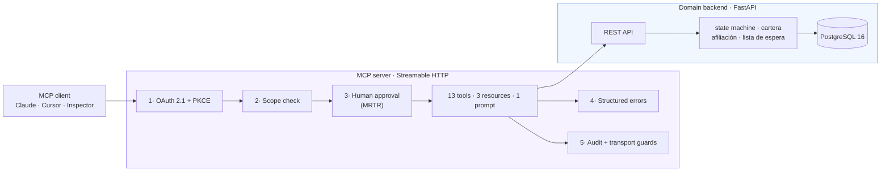

# dental-clinic-mcp-server

> A production-grade MCP server for a dental clinic: appointments, affiliation
> checks and accounts receivable, with the security controls that 92% of the
> MCP ecosystem does not have.
>
> 🇪🇸 [Léelo en español](./README.es.md)

<p align="left">
  
  
  
  
  
  
</p>

```bash
cp .env.example .env && make up && make smoke
```

---

## Why this exists

There are 22,000+ MCP servers listed publicly. Audited samples show **40% ship
with no authentication at all**, **79% handle credentials in plaintext**, and
**only 8.5% implement OAuth**. In January 2026 even Anthropic's own reference
server carried three CVEs: path traversal, arbitrary file deletion and RCE.

The domain here is not the differentiator; the engineering is. This repository
is a deliberate demonstration of what the other 8.5% looks like.

The failure mode it defends against is concrete. In July 2025 an AI agent
deleted a production database at SaaStr during a code freeze: it held write
permissions it never needed, and nobody could revoke them granularly. Its token
was valid, so scopes alone would not have stopped it. What was missing was a
human between intent and effect. Both are implemented here.

## Domain: why a dental clinic in Colombia

Nothing in this server is invented. The appointment state machine, the
affiliation check against the Colombian health regimes, the copayment rules and
the waiting list are the real process a clinic or IPS runs every day. Roughly
**25% of scheduled appointments go unused each month**, which is why 48-hour
confirmation and slot release exist. The tools implementing them attack a
quantified problem, not a demo script.

There is also a regulatory line that makes the security work necessary rather
than ornamental: **booking an appointment is not a medical act, but recording a
reason for consultation is.** The moment the system stores clinical data it
falls under Resolución 2654/2019, informed consent and RNBD registration with
the SIC. That boundary is exactly where the `clinical` scope and the mandatory
human approval live.

> **All data in this repository is synthetic**, generated by Faker with a fixed
> seed. No real patient information is present anywhere, at any point, and a
> test asserts it.

## Architecture



| Layer | Stack | Responsibility |
|---|---|---|
| Domain backend | FastAPI + PostgreSQL 16 + SQLAlchemy 2.x | Source of truth. Knows nothing about MCP. |
| MCP server | MCP Python SDK v2, Streamable HTTP (stateless) | Translates the domain into tools/resources/prompts. **Every security control lives here.** |
| Authorization server | In-repo OAuth 2.1 (or Keycloak) | Issues tokens. Swappable without touching the resource server. |

Separating the backend from the MCP server is itself the point: in production an
MCP server almost never *is* the system, it wraps one that already exists. The
LLM never touches the database directly.

Full reasoning and diagrams: [`docs/architecture.md`](./docs/architecture.md).

## The tool catalogue

Fourteen tools, not thirty. Model accuracy degrades past roughly 25–30 tools, so
a smaller, precisely described catalogue is the design, not a limitation.

| Scope | Tools |
|---|---|
| `read` | `buscar_paciente` · `consultar_disponibilidad` · `consultar_cita` · `listar_citas_paciente` · `consultar_cartera` · `validar_afiliacion` |
| `write` | `agendar_cita` · `confirmar_cita` · `cancelar_cita` · `reprogramar_cita` · `registrar_asistencia` · `ofrecer_cupo_lista_espera` |
| `clinical` | `registrar_motivo_consulta` |

Resources: `clinica://info`, `politicas://cartera`, `agenda://hoy`.
Prompt: `recepcionista_odontologia`.

**Every write and clinical tool pauses for a person**, over Multi Round-Trip
Requests. Calling `cancelar_cita` changes nothing; it comes back asking:

```jsonc
// round 1  →  tools/call cancelar_cita {cita_id: 412, motivo: "…"}
{
  "resultType": "input_required",
  "inputRequests": {
    "…": { "method": "elicitation/create", "params": {
      "message": "Cancelar la cita 412 de Ana Gómez del 2026-09-03 09:00.\n\nEsto va a pasar:\n  · La cita pasará de 'confirmada' a 'cancelada'.\n  · El cupo quedará libre en la agenda.\n  · Si hay lista de espera, se informará al siguiente.\n\n¿Confirmas la operación?",
      "requestedSchema": { "properties": { "confirmado": { "type": "boolean" } } }
    }}
  },
  "requestState": "v1.ZZs-yBzkr3f…"          // sealed, AES-256-GCM
}

// round 2  →  same call + inputResponses + requestState  →  "resultType": "complete"
```

One tool, two calls, no session. The confirmation is resolved by the client, so
it never appears in the tool's input schema: **the model has no field to approve
on the user's behalf.** The resolver re-runs on the second round, so scope and
domain checks are re-applied at the moment of effect.

## Security

Five layers, each answering a documented failure of the ecosystem. Full
write-up and threat model: [`docs/security.md`](./docs/security.md).

| # | Layer | What it stops |
|---|---|---|
| 1 | **OAuth 2.1 + PKCE**, no API keys anywhere | Anonymous access; a stolen authorization code |
| 2 | **Per-tool scopes** `read`/`write`/`clinical`, non-nesting | The confused deputy; the SaaStr shape of over-broad tokens |
| 3 | **Human-in-the-loop** over MRTR, with a sealed `requestState` | An agent mutating data on its own judgement |
| 4 | **Structured errors** with an actionable next step | Blind retry loops; leaked stack traces |
| 5 | **Audit trail + transport guards** | Unattributable changes; DNS rebinding; runaway agents |

Three hardening measures beyond the brief, because concurrent agents find them
in the first hour:

- **Double-booking is impossible at the database level**, via a partial unique
  index over the slot plus optimistic locking. An application-level check always
  loses that race.
- **Idempotency keys on booking**, so a retrying agent gets the same appointment
  back, not a duplicate.
- **Store UTC, present America/Bogota**. Naive datetimes are rejected rather
  than guessed.
- **Stateless transport.** A stateful application does not require a stateful
  transport: identity is in the token and a paused operation is in the client's
  sealed `requestState`, so any replica serves any request and there is no
  session to lose.

The scopes deliberately **do not nest**. A `write` token cannot read the reason
for consultation and a `clinical` token cannot cancel an appointment, because
"administrative" and "clinical" are different *kinds* of authority, not
different amounts of it.

## Quickstart

```bash
cp .env.example .env      # local placeholders only; no real secrets exist here
make up                   # postgres + backend + authorization server + mcp
make smoke                # walks the whole client path and prints each step
```

`make up` takes about ten seconds from cold and leaves you with:

| | |
|---|---|
| MCP server | `http://localhost:8080/mcp` |
| Domain API docs | `http://localhost:8000/docs` |
| Authorization server | `http://localhost:9000/.well-known/oauth-authorization-server` |

### Connect the MCP Inspector

```bash
make inspector            # opens the Inspector, already authenticated
make inspector-cli        # or list the catalogue without a browser
```

`make token` prints an access token obtained through the real PKCE flow, for
curl or for pasting into any client. Try issuing a `read`-only token and calling
`cancelar_cita`, the refusal explains exactly what to do next.

### Swap the authorization server for Keycloak

```bash
make keycloak             # Keycloak on :9100 + a second MCP server on :8081
make keycloak-verify      # proves the swap works, and that tokens don't cross over
```

`--profile keycloak` starts a **second MCP server**, same image, same code: trusting a real Keycloak realm instead of the in-repo authorization server, and
runs it side by side with the original. Only `OAUTH_ISSUER` and `OAUTH_JWKS_URL`
differ.

`make keycloak-verify` obtains a token from Keycloak, uses it against that
server, and then shows the two are **not** interchangeable: each server returns
`401` for the other's token. That refusal is the audience binding working, and
it is why the realm carries an explicit audience mapper. Keycloak omits `aud`
unless asked, and a resource server that accepts an audience-less token accepts
every token that IdP ever issued, to anyone.

## Development

```bash
make install     # uv sync
make lint        # ruff + mypy --strict
make test-unit   # fast tests, no docker required
make check       # everything CI runs
```

## Testing

Every layer is tested against the real thing: real PostgreSQL (never SQLite,
where partial unique indexes, native enums and timezone-aware timestamps do not
exist), the real MCP server, the real authorization server.

| Suite | What it proves |
|---|---|
| `tests/unit` | State machine (exhaustive 7×7 + property-based), affiliation, receivables, waiting-list ordering, time handling, error contracts |
| `tests/integration` | Schema constraints, migration reversibility, seed determinism, **two live connections racing for one slot** |
| `tests/contract` | The MCP surface: catalogue, tool schemas, descriptions, resources, prompt, and every tool executed end to end |
| `tests/security` | **The full 13 × 3 scope matrix** over the wire, the sealed request state under attack (tampering, cross-operation reuse, wrong principal, expiry, key rotation), PKCE enforcement, JWT audience and `alg=none`, Host/Origin guards, statelessness, rate limiting |
| `scripts/smoke.py` | The whole client path over real HTTP, run in CI |

809 tests: 350 unit, 231 integration, 82 contract, 146 security.
**Want to check it yourself?** [`docs/manual-testing.md`](./docs/manual-testing.md)
is a 25-minute walkthrough of thirteen checks, each saying what to run and what
you should see. [`docs/inspector.md`](./docs/inspector.md) covers the same ground
through the MCP Inspector.

CI gates on a 95% coverage floor (currently 99%), `mypy --strict`, `ruff`,
`bandit`, `pip-audit`, and a grep that fails the build if a secret-shaped
literal or a private key ever lands in the source.

## Repository layout

```
backend/            domain source of truth, knows nothing about MCP
  domain/           pure logic: estados, cartera, afiliacion, lista_espera, tiempo, errores
  models.py         SQLAlchemy 2.x schema · api.py  internal REST API
  seed.py           deterministic synthetic data (Faker, fixed seed)
mcp_server/
  tools/            read.py · write.py · clinical.py
  auth.py           OAuth verification and scopes      (layers 1-2)
  confirmacion.py   the question a person answers      (layer 3)
  errores.py        structured, actionable failures    (layer 4)
  auditoria.py      audit log · limites.py rate limit  (layer 5)
  oauth/            the in-repo authorization server
tests/              unit · integration · contract · security
docs/               architecture.md · security.md (bilingual)
```

## License

MIT. Portfolio project, Horizonte Labs.
