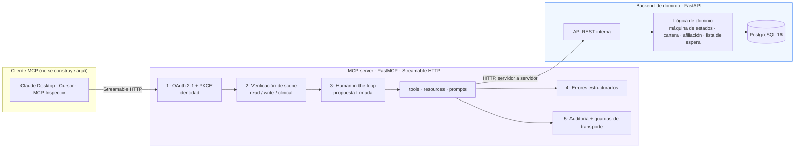
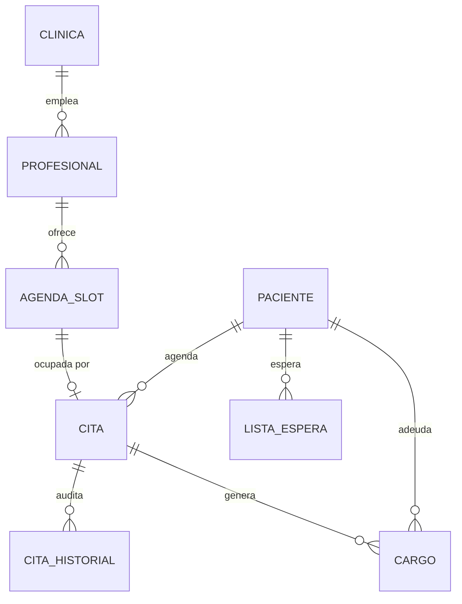
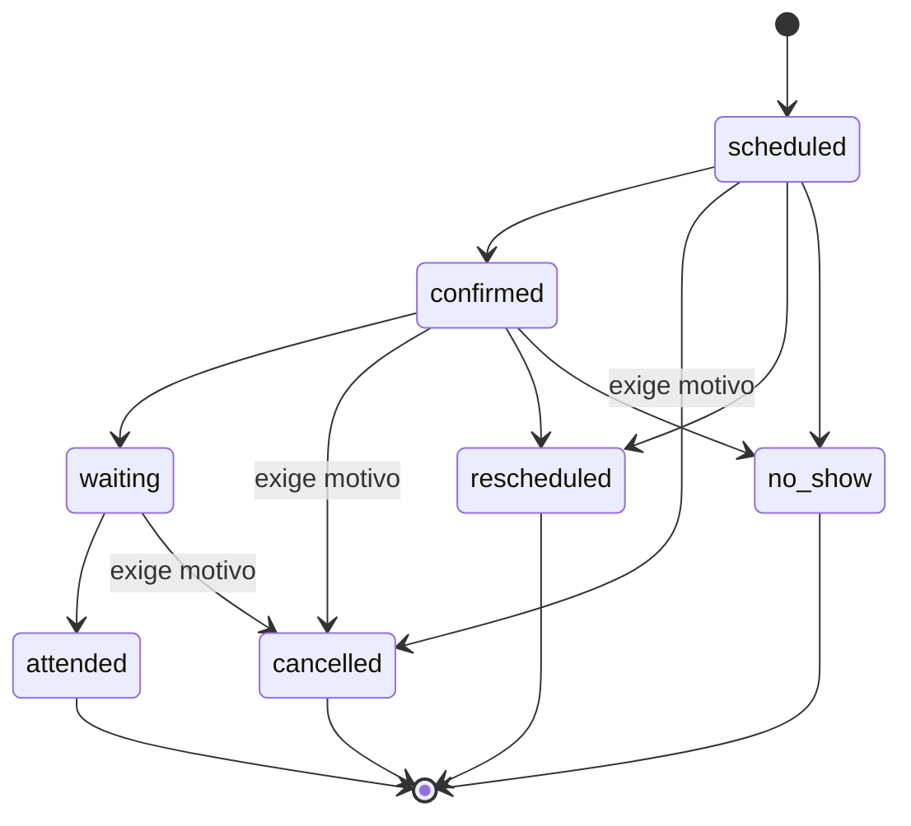

# Arquitectura

> 🇬🇧 [Read it in English](./architecture.md)

## Las tres capas



El LLM nunca llega a PostgreSQL. Toda petición atraviesa las cinco capas antes
de tocar una sola fila.

### Por qué el backend y el MCP server están separados

| Razón | Qué gana |
|---|---|
| Realismo | En producción el MCP server casi nunca *es* el sistema: envuelve uno que ya existe. Modelar esa separación es la forma honesta. |
| Seguridad | Los controles tienen exactamente un lugar donde vivir. No hay ruta del modelo a la base que los evite. |
| Reutilización | El mismo backend puede alimentar la demo web (v1.1) o un módulo de voz sin reescribir una línea de dominio. |

## Flujo de una petición

1. El cliente invoca una tool por Streamable HTTP (SSE está deprecado para producción).
2. **Capa 1** valida el access token de OAuth 2.1. Ausente o inválido ⇒ `401`
   con cabecera `WWW-Authenticate` apuntando al metadata del recurso protegido.
3. **Capa 2** compara los scopes del token con el que declara la tool. Un token
   `read` invocando `book_appointment` se rechaza aquí.
4. **Capa 3**, para toda tool `write` o `clinical`, devuelve `input_required` en
   lugar de actuar: la pregunta que una persona debe responder, más un
   `requestState` sellado. El cliente obtiene la respuesta y reintenta la misma
   llamada con ambos. El resolver vuelve a correr en esa segunda ronda, así que
   la autoridad y las reglas del dominio se revisan en el momento del efecto y no
   solo en el de la intención.
5. La tool llama a la API REST del backend.
6. **Capa 4** convierte todo fallo en `{codigo, mensaje, sugerencia, detalles}`.
7. **Capa 5** escribe la fila de auditoría, en la misma transacción que el cambio.

## Modelo de dominio



### La máquina de estados de la cita



Tres reglas viajan sobre este diagrama, todas implementadas en
`backend/domain/states.py` y probadas exhaustivamente:

- `cancelled` **exige motivo**. Cancelar sin razón destruye la capacidad de la
  clínica de auditar su propia tasa de inasistencia.
- `cancelled`, `rescheduled` y `no_show` **liberan el cupo**; solo
  `cancelled` dispara la lista de espera, porque una reprogramación mueve al
  mismo paciente y un no-show ocurre cuando el cupo ya transcurrió.
- `attended` y `no_show` **generan un cargo** en cartera.

## Decisiones que vale la pena discutir

### Valores en inglés, español para quien lee

Todo valor interno va en inglés: los valores del state machine, los códigos de
error, los nombres de las tools. Todo lo que lee un empleado de la clínica va
en español. Nunca se mezclan en una misma cadena.

La excepción son los valores con carga jurídica que el inglés no recoge, y esos
se quedan en español incluso en el cable: los estados de `cartera` (`al_dia`,
`en_mora`), los regímenes de afiliación (`contributivo`, `subsidiado`), los
conceptos de cargo (`copago`, `cuota_moderadora`) y los tipos de documento
colombianos. "Estar en mora" es una condición definida, no un sinónimo de
tardío.

`backend/domain/labels.py` es el único lugar donde un valor se vuelve palabras.
Quien lo llama pide la etiqueta cuando el valor le dice algo al lector, y
describe el efecto cuando no: a recepción le sirve más "el cupo quedará libre"
que "la cita pasará a 'cancelled'". Un test de contrato llama a todas las tools
de escritura y falla si algún valor interno aparece en la pregunta que aprueba
una persona, que fue como se coló la especialidad una vez y no sobrevivió.

### Guardar en UTC, presentar en America/Bogota

Todo timestamp persistido es UTC con zona; `backend/domain/time.py` es el
único lugar que convierte. Los datetime naive se rechazan en vez de asumirse:
adivinar una zona es como una agenda se corre cinco horas sin que nadie note.

### La doble reserva la impide la base de datos, no un `if`

Dos agentes leen «cupo libre» antes de que alguno escriba. Una validación en
aplicación no puede ganar esa carrera. Un índice único parcial sobre
`cita.slot_id`, restringido a los estados que realmente ocupan el cupo, hace que
la segunda reserva falle con un conflicto limpio. El bloqueo optimista sobre
`agenda_slot.version_id` cubre las ediciones concurrentes del cupo mismo.

```sql
CREATE UNIQUE INDEX uq_cita_slot_activa ON cita (slot_id)
  WHERE estado IN ('scheduled','confirmed','waiting','attended');
```

### Claves de idempotencia al agendar

Un agente que reintenta una llamada que expiró debe recibir la misma cita, no
una segunda. `cita.idempotency_key` es única; el reintento choca contra la
restricción en vez de crear un duplicado.

### Migraciones, no `create_all`

La suite construye su esquema con `alembic upgrade head`, así que un cambio de
modelo sin migración rompe CI. `tests/integration/test_migrations.py` además
verifica que el esquema migrado sigue coincidiendo con los modelos y que la
migración es reversible.

## Estructura del repositorio

```
backend/            fuente de verdad del dominio, no sabe nada de MCP
  domain/           lógica pura: states, cartera, afiliacion, waiting_list, time, errors
  models.py         esquema SQLAlchemy 2.x
  seed.py           datos sintéticos deterministas (Faker, semilla fija)
  api.py            API REST interna
  migrations/       alembic
mcp_server/
  tools/            read.py · write.py · clinical.py
  context.py       todo lo que necesitan las tools, inyectado en vez de global
  auth.py           verificación de token y scopes            (capas 1-2)
  confirmation.py   la pregunta que responde una persona      (capa 3)
  errors.py        fallos estructurados para el modelo       (capa 4)
  audit.py      log de auditoría · rate_limit.py  rate limit (capa 5)
  client.py        cliente HTTP hacia el backend
  resources.py       resources y el prompt de recepcionista
  oauth/            el Authorization Server propio
tests/
  unit/             dominio puro, sin base de datos ni docker
  integration/      PostgreSQL real: esquema, concurrencia, seed, migraciones
  contract/         superficie del protocolo MCP, cada tool de punta a punta
  security/         matriz de scopes, aprobaciones, OAuth, guardas de transporte
scripts/            get_token.py (flujo PKCE) · smoke.py (punta a punta)
docs/
```
