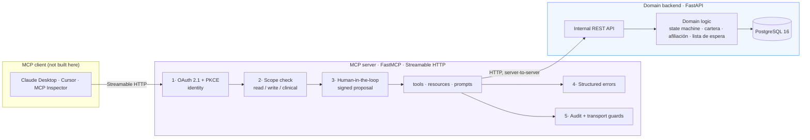
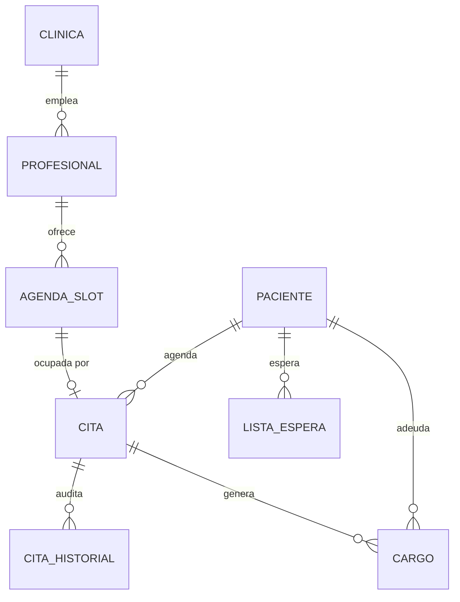
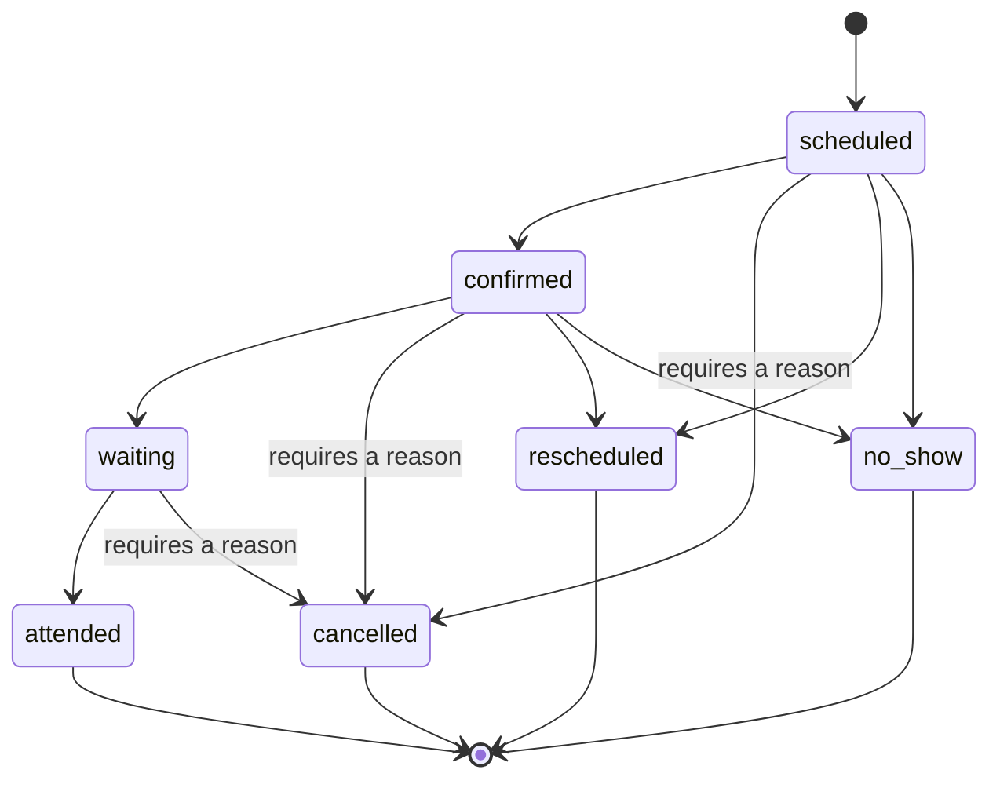

# Architecture

> 🇪🇸 [Léelo en español](./architecture.es.md)

## The three layers



The LLM never reaches PostgreSQL. Every request crosses the five controls
before a single row is touched.

### Why the backend and the MCP server are separate

| Reason | What it buys |
|---|---|
| Realism | In production an MCP server almost never *is* the system, it wraps one that already exists. Modelling that separation is the honest shape. |
| Security | The security controls have exactly one place to live. There is no path from the model to the database that bypasses them. |
| Reuse | The same backend can feed the web demo (v1.1) or a voice module without rewriting a line of domain logic. |

## Request flow

1. The client calls a tool over Streamable HTTP (SSE is deprecated for production).
2. **Layer 1** validates the OAuth 2.1 access token. Missing or invalid ⇒ `401`
   with a `WWW-Authenticate` header pointing at the protected-resource metadata.
3. **Layer 2** checks the token's scopes against the scope the tool declares.
   A `read` token calling `book_appointment` is refused here.
4. **Layer 3**, for any `write` or `clinical` tool, returns `input_required`
   instead of acting: the question a person must answer, plus a sealed
   `requestState`. The client obtains the answer and retries the same call
   carrying both. The resolver runs again on that second round, so authority and
   the domain rules are re-checked at the moment of effect rather than only at
   the moment of intent.
5. The tool calls the backend REST API.
6. **Layer 4** converts every failure into `{codigo, mensaje, sugerencia, detalles}`.
7. **Layer 5** writes the audit row, in the same transaction as the change.

## Domain model



### The appointment state machine



Three rules ride on this diagram, all of them enforced in
`backend/domain/states.py` and exhaustively tested:

- `cancelled` **requires a reason**. A cancellation without one destroys the
  clinic's ability to audit its own no-show rate.
- `cancelled`, `rescheduled` and `no_show` **free the slot**; only
  `cancelled` triggers the waiting list, because a reschedule moves the same
  patient and a no-show happens once the slot has already elapsed.
- `attended` and `no_show` **produce a charge** in accounts receivable.

## Decisions worth arguing about

### English values, Spanish for the person reading

Every internal value is English: state-machine values, error codes, tool names.
Every word a clinic employee reads is Spanish. The two never mix in one string.

The exceptions are values with legal weight that English does not carry, and
they stay Spanish on the wire too: `cartera` states (`al_dia`, `en_mora`),
affiliation regimes (`contributivo`, `subsidiado`), charge concepts (`copago`,
`cuota_moderadora`) and Colombian document types. "Estar en mora" is a defined
condition, not a synonym for late.

`backend/domain/labels.py` is the only place a value becomes words. Callers ask
it for a label when the value informs the reader, and say what changes when it
does not: the front desk learns more from "el cupo quedará libre" than from
"la cita pasará a 'cancelled'". A contract test calls every write tool and
fails if any internal value shows up in the question a human approves, which is
how the specialty leaked into it once and did not survive.

### Store UTC, present America/Bogota

Every persisted timestamp is timezone-aware UTC; `backend/domain/time.py` is
the only place that converts. Naive datetimes are rejected rather than assumed: guessing a timezone is how a schedule silently drifts five hours.

### Double-booking is prevented by the database, not by an `if`

Two agents both read "slot free" before either writes. An application-level
check cannot win that race. A partial unique index over `appointment.slot_id`,
restricted to the states that actually hold a slot, means the second booking
fails with a clean conflict. Optimistic locking on `agenda_slot.version_id`
covers concurrent edits to the slot itself.

```sql
CREATE UNIQUE INDEX uq_appointment_slot_active ON appointment (slot_id)
  WHERE status IN ('scheduled','confirmed','waiting','attended');
```

### Idempotency keys on booking

An agent that retries a timed-out call must get the same appointment back, not a
second one. `appointment.idempotency_key` is unique; the retry hits the constraint
instead of creating a duplicate.

### Migrations, not `create_all`

The test-suite builds its schema with `alembic upgrade head`, so a model change
without a migration fails CI. `tests/integration/test_migrations.py` also
asserts the migrated schema still matches the models and that the migration is
reversible.

## Repository layout

```
backend/            domain source of truth, knows nothing about MCP
  domain/           pure logic: states, cartera, afiliacion, waiting_list, time, errors
  models.py         SQLAlchemy 2.x schema
  seed.py           deterministic synthetic data (Faker, fixed seed)
  api.py            internal REST API
  migrations/       alembic
mcp_server/
  tools/            read.py · write.py · clinical.py
  context.py       everything the tools need, injected rather than global
  auth.py           token verification and scopes            (layers 1-2)
  confirmation.py   the question a person answers            (layer 3)
  errors.py        structured failures for the model        (layer 4)
  audit.py      audit log · rate_limit.py  rate limiting    (layer 5)
  client.py        HTTP client to the backend
  resources.py       resources and the receptionist prompt
  oauth/            the in-repo authorization server
tests/
  unit/             pure domain, no database, no docker
  integration/      real PostgreSQL: schema, concurrency, seed, migrations
  contract/         MCP protocol surface, every tool end to end
  security/         scope matrix, approvals, OAuth, transport guards
scripts/            get_token.py (PKCE flow) · smoke.py (end-to-end)
docs/
```
